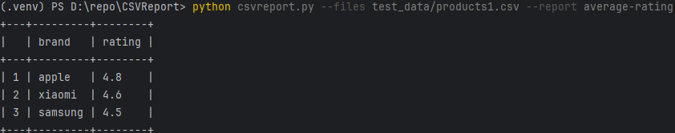
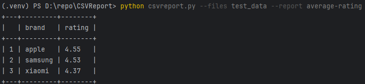
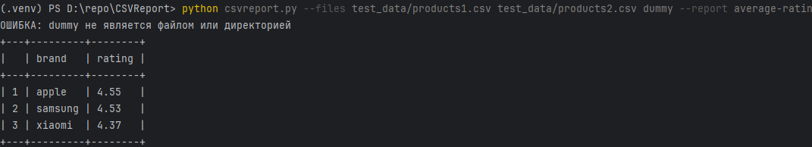
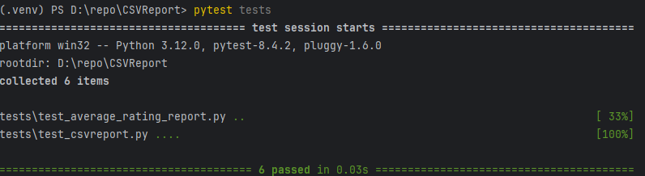

## Примеры запуска

### Запуск с именем файла в качестве значения параметра
```python
python csvreport.py --files test_data/products1.csv --report average-rating
```
Результат:



### Запуск с именем директории в качестве значения параметра
```python
python csvreport.py --files test_data --report average-rating
```
Результат:



### Запуск с несколькими значениями параметра, включая невалидное (dummy)
```python
python csvreport.py --files test_data/products1.csv test_data/products2.csv dummy --report average-rating
```
Результат:



## Запуск тестов
```commandline
pytest tests
```

Результат:



## Добавление новых отчётов
Программа использует динамическое подключение модулей отчётов при помощи библиотеки **importlib**.
Для создания и подключения нового отчёта нужно сделать следующие шаги:
1. в папке **reports** создать файл, который должен заканчивать на "_report.py";
2. в указанном выше файле должна быть задана переменная **FLAG_NAME**;
3. также файл должен содержать функцию **execute(args)**, которая в качестве параметра принимает список вида:
List[List[str, str, float, float]], где элементами второго списка являются: имя продукта, бренд, 
цена и рейтинг соотвественно.

